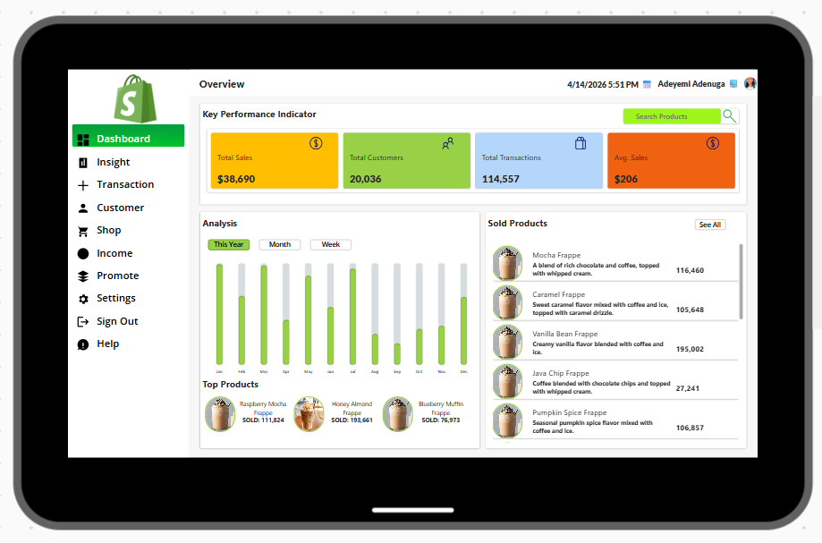

# E-Commerce Sales Performance Dashboard: A Deep Dive into Data-Driven Retail

## By Manus AI

## Introduction

In the rapidly evolving world of e-commerce, understanding sales performance and customer behavior is paramount for sustained growth and competitive advantage. This report delves into an E-Commerce Sales Performance Dashboard, a powerful business intelligence tool built using Microsoft Power Apps. Designed to provide a comprehensive overview of retail operations, this dashboard transforms raw data into actionable insights, enabling businesses to make informed decisions and optimize their strategies.

## Project Background

The core objective of this project was to develop an interactive dashboard that visualizes key e-commerce metrics. By leveraging Power Apps, the aim was to create a solution that is not only visually intuitive but also capable of presenting complex sales data in an easily digestible format. This dashboard serves as a central hub for monitoring performance, identifying trends, and understanding the dynamics of an online retail environment.

## Objective of the Analysis

Our analysis of this E-Commerce Sales Performance Dashboard focuses on several key areas:

*   **Identification of Key Performance Indicators (KPIs):** Understanding the critical metrics that drive business success.
*   **Sales Trend Analysis:** Examining patterns and fluctuations in sales over time.
*   **Product Performance Evaluation:** Pinpointing top-selling products and those requiring attention.
*   **Demonstration of Power Apps Capabilities:** Showcasing the platform's ability to create robust, interactive business applications.

## Dataset and Tools

### Dataset

The dashboard operates on a **Demo Data** set, meticulously crafted to simulate real-world e-commerce scenarios. This dataset encompasses a range of information, including transaction records, customer demographics, and detailed product sales figures, providing a realistic foundation for performance analysis.

### Tools

*   **Microsoft Power Apps:** The primary development platform for the interactive dashboard. Power Apps facilitates rapid application development, allowing for the creation of rich, custom business applications with minimal coding.
*   **GitHub:** Utilized for version control, ensuring collaborative development and secure storage of project documentation and reports.

## Dashboard Overview

The E-Commerce Sales Performance Dashboard is intuitively organized, presenting a clear hierarchy of information. It features a prominent section for Key Performance Indicators (KPIs), a dynamic analysis section illustrating monthly sales trends, and a detailed breakdown of product performance.

## Key Performance Indicators (KPIs)

The dashboard immediately highlights four crucial KPIs, offering an instant snapshot of the business's operational health:

| KPI                 | Value       | Description                                        |
| :------------------ | :---------- | :------------------------------------------------- |
| **Total Sales**     | $38,690     | The aggregate revenue generated over the period.   |
| **Total Customers** | 20,036      | The total number of unique customers.              |
| **Total Transactions** | 114,557     | The total count of completed sales transactions.   |
| **Avg. Sales**      | $206        | The average revenue per transaction.               |

These figures collectively paint a picture of a moderately active e-commerce platform with a substantial customer base and a healthy average transaction value. Such insights are vital for strategic planning and performance benchmarking.

## Sales Analysis: Unpacking Annual Trends

The 
Analysis section of the dashboard provides a granular view of sales performance throughout the year. A bar chart visually represents monthly sales volumes, with green bars indicating actual sales and grey bars potentially representing targets or capacity. The data reveals a dynamic sales landscape, characterized by periods of strong performance (e.g., January to April), followed by a mid-year dip (May to July), and a subsequent recovery towards the year-end (October to December). This trend analysis is crucial for inventory management, marketing campaign timing, and resource allocation.

## Product Performance: Identifying Stars and Underperformers

The dashboard offers a dual perspective on product performance, categorizing items into "Top Products" and a detailed list of "Sold Products."

### Top Products

This section highlights products that have achieved significant sales volumes:

| Product                 | Units Sold |
| :---------------------- | :--------- |
| Raspberry Mocha Frappe  | 111,824    |
| Honey Almond Frappe     | 193,661    |
| Blueberry Muffin Frappe | 76,973     |

The **Honey Almond Frappe** emerges as a clear leader among the top products, indicating strong customer preference and market demand.

### Sold Products

A more detailed breakdown of individual product sales provides further insights:

| Product              | Description                                          | Units Sold |
| :------------------- | :--------------------------------------------------- | :--------- |
| Mocha Frappe         | A blend of rich chocolate and coffee, topped with whipped cream. | 116,460    |
| Caramel Frappe       | Sweet caramel flavor mixed with coffee and ice, topped with caramel drizzle. | 105,648    |
| Vanilla Bean Frappe  | Creamy vanilla flavor blended with coffee and ice.   | 195,002    |
| Java Chip Frappe     | Coffee blended with chocolate chips and topped with whipped cream. | 27,241     |
| Pumpkin Spice Frappe | Seasonal pumpkin spice flavor mixed with coffee and ice. | 106,857    |

Among the listed items, the **Vanilla Bean Frappe** stands out with an impressive 195,002 units sold, solidifying its position as a top-tier product. Conversely, the **Java Chip Frappe** shows the lowest sales figures, suggesting it might benefit from targeted promotional efforts or a re-evaluation of its market positioning.

## Conclusion

This E-Commerce Sales Performance Dashboard, meticulously crafted with Power Apps, serves as an invaluable asset for any online retail business. It effectively distills complex sales data into digestible insights, enabling stakeholders to monitor KPIs, understand sales trends, and assess product performance with unparalleled clarity. The dashboard not only demonstrates the analytical power of visual data but also underscores the potential of Power Apps in delivering tailored business intelligence solutions that drive strategic growth.

## Future Enhancements

To further augment the utility and depth of this dashboard, several enhancements could be considered:

*   **Customer Segmentation Analysis:** Integrating data to analyze sales performance based on various customer segments (e.g., demographics, purchasing behavior).
*   **Geographical Sales Mapping:** Visualizing sales data across different regions to identify market-specific trends and opportunities.
*   **Predictive Analytics Integration:** Incorporating machine learning models to forecast future sales, demand, and potential market shifts.
*   **Inventory Optimization:** Linking sales data with real-time inventory levels to prevent stockouts and overstocking.
*   **Custom Date Range Selection:** Empowering users with the flexibility to define and analyze sales data over arbitrary time periods.

## GitHub Repository

The complete project documentation, including the original report and supporting files, is available on GitHub:
[https://github.com/Adenuga-Adeyemi/Power-Apps-Projects/tree/main/ecommerce-dashboard-analysis](https://github.com/Adenuga-Adeyemi/Power-Apps-Projects/tree/main/ecommerce-dashboard-analysis)

---
*Report prepared by Manus AI*
