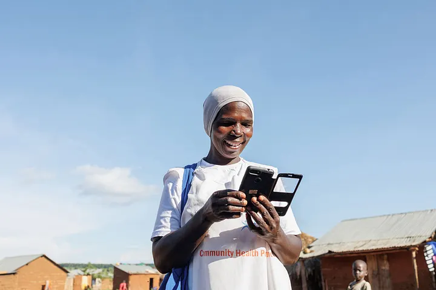
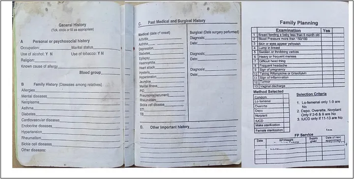
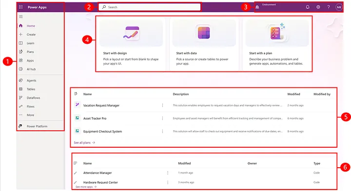
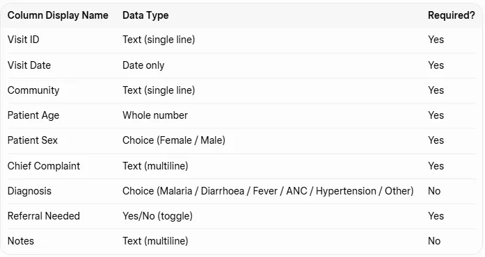
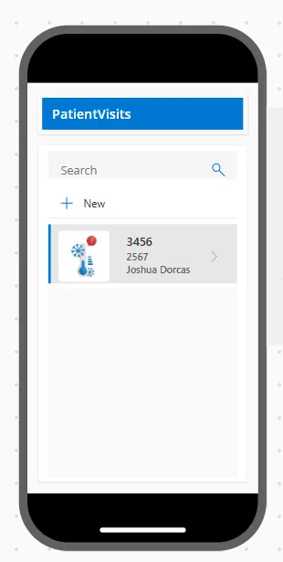
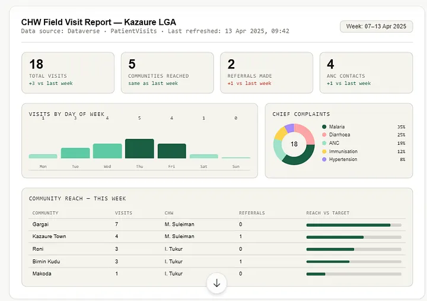

# PHC Field Reporting App: A Complete Build Guide for Real-Time Community Health Data in Nigeria

## Project Overview

This project details the development of a **PHC Field Reporting App** using Microsoft Power Apps, designed to revolutionize community health data collection in rural Nigeria. The app aims to replace traditional paper-based Health Management Information System (HMIS) forms with a digital solution, enabling real-time data capture and reporting by Community Health Workers (CHWs).

## Background

In rural Nigeria, CHWs often face challenges with paper-based data collection, leading to delayed, incomplete, or lost data. This hinders effective decision-making by supervisors at the Local Government Area (LGA) level, impacting drug supply management and outbreak detection. The PHC Field Reporting App addresses these pain points by providing a simple, mobile-friendly digital form that instantly saves data to Microsoft Dataverse and visualizes it in real-time Power BI dashboards.

## Objective

The primary objective of this project is to:
*   **Digitize Data Collection:** Transition from paper-based HMIS forms to a digital mobile application for CHWs.
*   **Enable Real-Time Reporting:** Ensure that patient visit data is instantly available to supervisors via Power BI dashboards.
*   **Improve Data Accuracy and Timeliness:** Reduce errors and delays associated with manual data entry.
*   **Support Data-Driven Decision Making:** Provide timely and accurate insights for better resource allocation and public health interventions.

## Target Audience

The app is specifically designed for CHWs with basic phone literacy, working on low-end Android devices, often with 2G/3G connections and limited English fluency. The design prioritizes simplicity, short forms, buttons, default values, and dropdowns over free text input to accommodate these constraints.

## Key Features

*   **Mobile Data Entry:** CHWs can record patient visits directly on their smartphones.
*   **Microsoft Dataverse Integration:** All records are saved instantly and securely to Dataverse.
*   **Real-Time Power BI Dashboard:** Supervisors can view live data for immediate insights.
*   **User-Friendly Interface:** Optimized for basic phone literacy and challenging field conditions.

## Technologies Used

*   **Microsoft Power Apps:** For building the mobile canvas application.
*   **Microsoft Dataverse:** As the secure and scalable database for storing health data.
*   **Microsoft Power BI:** For creating interactive dashboards for data visualization and analysis.
*   **Microsoft 365 Developer Tenant:** Provides the necessary environment and licenses for development.

## Implementation Steps (Summary)

The project outlines a step-by-step guide covering:
1.  **Environment Setup:** Obtaining a Microsoft 365 Developer Tenant and signing into Power Apps.
2.  **Dataverse Table Creation:** Building the `PHC Patient Visit` table with essential columns like Visit ID, Visit Date, Community, Patient Age, Patient Sex, Chief Complaint, Diagnosis, Referral Needed, and Notes.
3.  **Canvas App Building:** Auto-generating the app from Dataverse, switching to phone layout, and customizing the edit form and gallery screen for optimal field use.
4.  **Power BI Connection:** Setting up Power BI Desktop, connecting to Dataverse, and loading/cleaning the data.
5.  **DAX Measures:** Implementing key DAX measures for Total Visits, Referral Rate, Communities Reached, and Average Patient Age.
6.  **Supervisor Dashboard:** Suggesting a Power BI dashboard layout for supervisors.

## Limitations

*   **Internet Connectivity:** The app requires an internet connection to submit data. In deep rural areas without mobile data, records cannot be saved immediately.

## Screenshots

### PHC Field Reporting App Hero Image

### Patient Medical History File (Paper)

### Power Apps Maker Portal

### Dataverse Columns Configuration

### Canvas App Preview

### Power BI Supervisor Dashboard

## Source Article

[PHC Field Reporting App: A Complete Build Guide for Real-Time Community Health Data in Nigeria](https://medium.com/@adeyemi.da/phc-field-reporting-app-a-complete-build-guide-for-real-time-community-health-data-in-nigeria-f03146677fe9)
