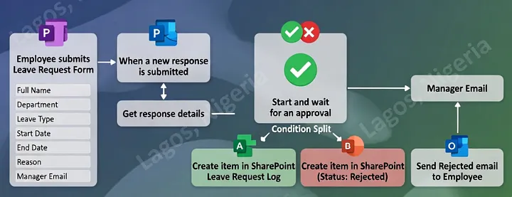
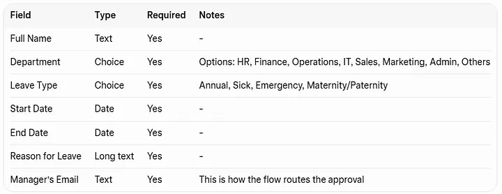
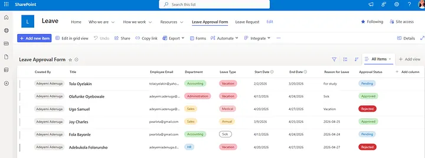

# How to Build a Leave Approval Flow in Power Automate (for a Nigerian Organisation)
!(https://github.com/Adenuga-Adeyemi/Power-Apps-Projects/blob/main/leave-approval-flow/Screenshot%202026-04-20%20190256.png)
## Project Overview

This project outlines the creation of a **fully automated leave approval system** using Microsoft 365 tools, specifically tailored for Nigerian organizations. The system aims to streamline the leave request process, moving away from informal methods like WhatsApp messages and verbal approvals to a structured, auditable, and professional workflow.

## Background

Many Nigerian workplaces still rely on informal methods for leave requests, leading to issues such as forgotten approvals, disputes over approvals, and difficulties in retrieving records for payroll or audits. This Power Automate flow addresses these challenges by providing a robust system that ensures all leave requests are timestamped, auditable, and professionally managed within the Microsoft 365 ecosystem.

## Objective

The primary objective of this project is to build an automated leave approval system that:
*   **Automates the entire leave request and approval process.**
*   **Provides a clear audit trail** for all leave requests and decisions.
*   **Reduces manual errors and delays** associated with traditional methods.
*   **Ensures transparency and accountability** for both employees and managers.
*   **Leverages existing Microsoft 365 tools** without requiring additional paid software.

## Key Data Captured

The system is designed to capture essential leave request information, including:
*   Full Name
*   Department
*   Leave Type (e.g., Annual, Sick, Emergency, Maternity/Paternity)
*   Start Date & End Date
*   Reason for Leave
*   Approval Status (Pending, Approved, Rejected)

## Technologies Used

*   **Microsoft Forms:** For employees to submit leave requests.
*   **Microsoft Power Automate:** To orchestrate the approval workflow, send notifications, and update records.
*   **Microsoft SharePoint:** To log all leave requests and their approval statuses, serving as a central, auditable database.
*   **Microsoft 365:** The overarching platform providing the necessary tools and environment.

## Implementation Steps (Summary)

The project details a step-by-step guide to building the leave approval flow:
1.  **Build the Microsoft Form:** Create a 
Staff Leave Request Form" with required fields.
2.  **Set Up the SharePoint Log:** Create a SharePoint list named "Leave Request Log" to store all leave requests and their statuses.
3.  **Build the Power Automate Flow:**
    *   **Trigger:** "When a new response is submitted" in Microsoft Forms.
    *   **Get response details:** Retrieve all data from the submitted form.
    *   **Connect with SharePoint Log:** Create a new item in the SharePoint list with the form data.
    *   **Send approval email to manager:** Use the "Start and wait for an approval" action, sending a formatted email with Approve/Reject buttons to the manager.
    *   **Add Condition:** Branch the flow based on the manager's approval decision.
    *   **Update SharePoint Log:** Update the status of the leave request in SharePoint to "Approved" or "Rejected" based on the manager's action.
    *   **Email the employee:** Send a confirmation email to the employee with the approval status.
    *   **Create an event (optional):** Add an event to the employee's calendar if the leave is approved.
4.  **Test the Flow:** Thoroughly test the end-to-end process with various scenarios.

## Limitations

*   **No automatic date validation:** The current form accepts any date, including past dates. This could be enhanced with a condition to automatically reject invalid date requests.
*   **Single approver, no delegation or timeout:** The flow currently supports a single approver without delegation or timeout features. For enterprise versions, a timeout with escalation to HR or a delegation feature would be beneficial.

## Screenshots

### An Approval Flow Using Power Automate

### Microsoft Form Fields Configuration

### SharePoint Log After Tests

## Source Article

[How to Build a Leave Approval Flow in Power Automate (for a Nigerian Organisation)](https://medium.com/@adeyemi.da/how-to-build-a-leave-approval-flow-in-power-automate-for-a-nigerian-organisation-21512552aad8)
